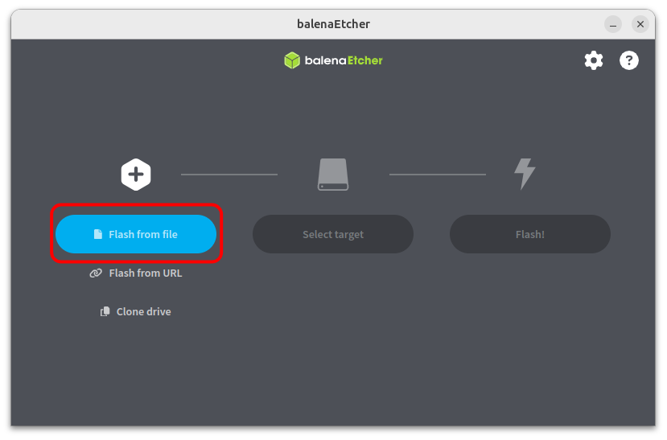
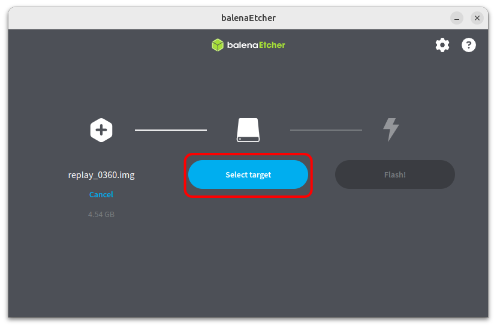

# Installation

First we need to install Replay OS into your MicroSD card.

## Flashing the image

* We suggest you to use [balenaEtcher](https://www.balena.io/etcher/){target=_blank} for flashing the system to the MicroSD card.
Download it from their [official web site](https://www.balena.io/etcher/){target=_blank} and install it.

* Next, download the latest version of RePlay OS from the [Download](./download.md) section.

* Now insert your MicroSD card into your computer and open balenaEtcher. Then, click on **Flash from file**:

* Navigate to your download folder and select the RePlay OS image file:

* Next click on **Select target** and select your MicroSD card where the system will be installed:

* Finally click on the **Flash!** button and wait until the flashing operation finish:

* When the operation completes, you'll see **Flash complete!** and **1 Successful target**.
If the flash fails, try again. If it still fails, your MicroSD card could be broken, so use a different MicroSD card.

* Finally, you can close balenaEtcher, remove the MicroSD card and plug it into your Raspberry device.

## Connect the primary HDMI

**IMPORTANT:** Ensure you are using the primary HDMI port when booting your Raspberry Pi. Using the wrong port will result in a black screen.

## First Boot

When booting your Raspberry Pi for the first time, it will perform some initial operations silently (black screen), such as creating and expanding a new FAT partition on the MicroSD card for storing your ROMs, BIOS, saves, and config files.

Please note that these operations could take some time, so be patient. **DO NOT POWER OFF** the device and wait until the system displays the user interface.

Congratulations! You are now ready for fun!