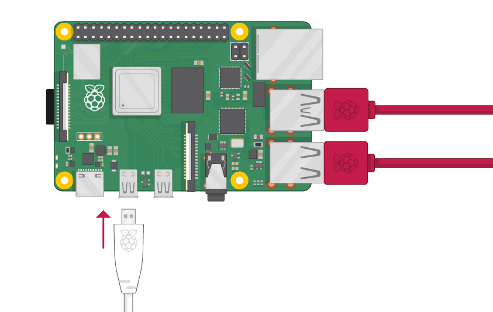
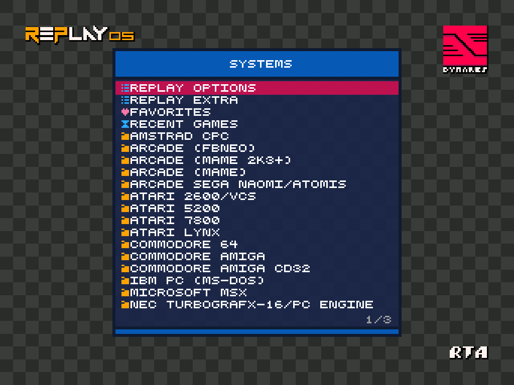

# Installation

First we need to install RePlayOS into your MicroSD card. Current releases use a compressed raw SD-card image (`.img.xz`).

## Flashing the image

* First, download the latest version of RePlayOS from the [Download](./download.md) section.

* Next, use [Raspberry Pi Imager](https://www.raspberrypi.com/software/){target=_blank} or [balenaEtcher](https://etcher.balena.io/) to flash the image to the MicroSD card.

* After finishing, remove the MicroSD card and plug it into your Raspberry device.

## Connect the primary HDMI

**IMPORTANT:** Ensure you are using the primary HDMI port when booting your Raspberry Pi. Using the wrong port will result in a black screen.

## First Boot

When booting your Raspberry Pi for the first time, it will perform some initial operations silently (black screen), such as creating and expanding an exFAT `replay` partition on the MicroSD card for storing your ROMs, BIOS, saves, and config files.

Please note that these operations could take some time, so be patient. **DO NOT POWER OFF** the device and wait until the system displays the user interface.

Congratulations! You are now ready for fun!

## Reflashing an existing v2 SD card

Reflashing a compatible RePlayOS v2 image preserves a valid exFAT `replay` data partition. This is a migration convenience, not a backup: make a separate copy of your ROMs, BIOS, saves, and configuration before flashing.

Do not assume that an older v1 image has the same partition layout. For v1-to-v2 migrations, back up the data partition and perform a clean installation.
