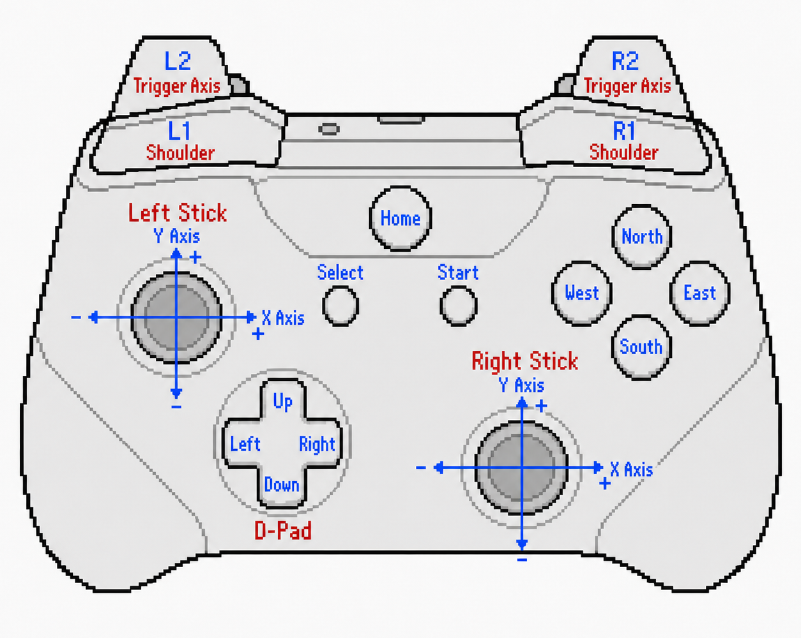

# Physical Controller Mapping

RePlayOS includes the official [SDL_GameControllerDB](https://github.com/mdqinc/SDL_GameControllerDB){target=_blank}, plus RePlay-specific mappings, for more than **700** controllers and revisions. These physical mappings translate each controller's raw buttons, hats, and axes into a consistent SDL gamepad layout.

## Custom Controller Mapping

Create a physical mapping only when a controller is not recognized or its SDL layout is incorrect. This is different from changing what a button does in a particular system or game; gameplay mappings are explained in [Gamepad Configuration](gpadbasic.md).

RePlay opens the mapper automatically when a newly connected controller is unsupported. Use the manual process below when SDL recognizes the controller but its existing physical layout is wrong.

### Mapping Process

1. Connect the controller and open `REPLAY OPTIONS > INPUT`.
2. Open the Player slot containing that controller and select `PHYSICAL MAPPING`.
3. Follow the visual prompts to map its controls. Use Space or an already mapped control to skip a requested control that is not present.
4. Complete the sequence. RePlay applies the new SDL mapping immediately and saves it automatically.

The custom mapping is stored in `<data location>/config/input/usercontrollerdb.txt` and loaded after the bundled databases, so it overrides their entry for the same SDL GUID. Controllers that share the same GUID also share this physical mapping.

Physical mapping does not select a Player slot and is not saved per system, folder, or game. Player assignments are stored separately, and changing an SDL display name does not change a controller's assignment.

## Input Layout Design

RePlayOS uses positional SDL button names so controllers with Xbox, Nintendo, PlayStation, or arcade layouts can share the same logical layout. Map controls by their physical position rather than the letter printed on the controller.

### Visual Mapping Guide

For a clearer understanding of the button mapping process, refer to the visual guide below:

Use this guide to match each prompt to the intended physical position.
