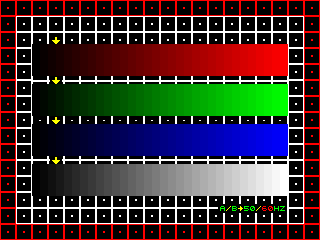
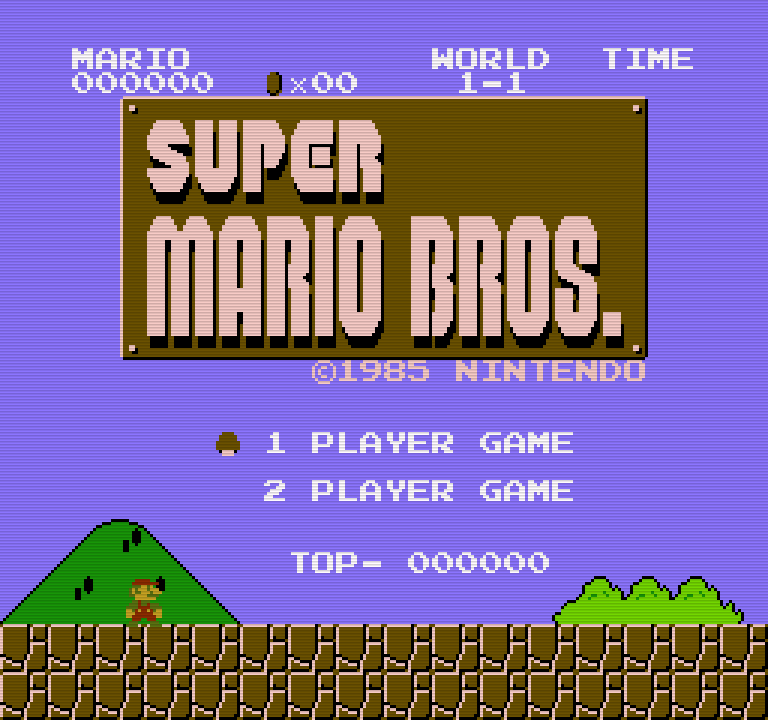
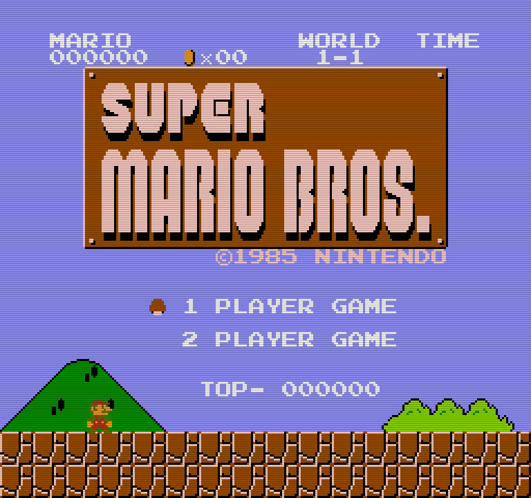

# Video Configuration

Below you can find a description of some basic video configurations and features on RePlayOS. You can change the resolution, add some video filters, select different scaling modes, enable dual screen, and more.

## Video Connector

* `HDMI`: used for both HDMI>LCD and HDMI>DAC>CRT modes
* `DPI (GPIO)`: enables limited support for legacy RGB-Pi (GPIO) model in Raspberry Pi5 (must be enabled from `ADDONS` option)
    - Pi5 only
    - No audio support
    - Supports both LCD and CRT modes (defaults to CRT)
    - Supports stable interlaced mode in CRT 15KHz mode
    - Interlaced requires [EEPROM Update](eeprom.md) >= 2025-11-05 (see note below)
    - Provides its own EDID information:
        Monitor name: RPI-DPI-VGA
        Vendor: RTA
        Supported VGA modes:
        ```sh
            Mode 0: 1920x1080@60 
            Mode 1: 1920x1080@50 
            Mode 2: 1280x720@60 
            Mode 3: 1280x720@50 
            Mode 4: 1024x768@75 
            Mode 5: 1024x768@70 
            Mode 6: 1024x768@60 (*)
            Mode 7: 800x600@75 
            Mode 8: 800x600@60 
            Mode 9: 640x480@75 
            Mode 10: 640x480@60 
            Mode 11: 640x480@60 
            Mode 12: 720x400@70
        ```
**NOTE:** RePlay RC7+ automatically checks for and installs a customized 2025-11-05 EEPROM if a lower version is detected. Please check the [EEPROM Update](eeprom.md) section for further details.

## Video Mode

You can select the desired video mode from `REPLAY OPTIONS > VIDEO > VIDEO MODE`:

* `CRT/LCD AUTO`: this mode automatically selects the type (CRT or LCD), and native resolution of your monitor. However, please note that this only applies to resolutions up to 1920x1080 for LCD. This limitation ensures backward compatibility with all Raspberry Pi models and addresses performance considerations. Consequently, even if you have a 4K monitor, the system will configure it to a maximum resolution of 1920x1080.
* `CRT 320X240@60/NRR`: this enables analog video support in 240p mode, which is the standard for any commercial CRT TV. It boot in 60Hz mode and uses native refresh rates (**NRR**) for each system/game. When used in combination of the corresponding CRT Type option, it is also able to automatically scale to 480p when used with high-resolution arcade 31kHz monitors, such as those found in NAOMI cabinets.
* `CRT 320X240@50/NRR`: same as `CRT 320X240@60/NRR` but boots the UI in 50Hz mode.
* `LCD NATIVE@60/NRR`: This mode uses your monitor’s native resolution and native refresh rates (**NRR**) for different systems and games when available. The refresh rate selected depends on the [LCD monitor type](#lcd-type) chosen in the corresponding option.
* `LCD 1920X1080@60`
* `LCD 1280X720@60`
* `LCD 1280X1024@60`
* `LCD 1024X768@60`
* `LCD 2560x1440@60`: experimental 2K resolution for Raspberry PI 5 and higher.
* `LCD 3840x2160@60`: experimental 4K resolution for Raspberry PI 5 and higher.

**NOTE:** when changing between LCD and CRT modes, you must reboot the system to apply the configuration.

## Multi Screen

RePlayOS is able to make use of dual screen configuration in both LCD and CRT configurations. You can select different modes from `REPLAY OPTIONS > VIDEO > MULTI SCREEN`:

* `DISABLED`: for single screen configuration.
* `DUAL DUPLICATE`: clones the image in both screens. Useful for streaming or recreating arcades like Sega Versus City. 
* `DUAL HORIZONTAL`: uses both screens in horizontal extended way. Useful for dual screen arcade games like Sagaia or OutRunners.
* `DUAL VERTICAL`: uses both screens in vertical extended way. Useful for arcades like Punch-Out or Nintendo DS.

## LCD Type

Allows you to choose different TV and monitor types.

* `TV & PC 60Hz`: choose this if your monitor does not support VRR. Supported native refresh rates: 55-61 Hz.
* `TV & PC VRR`: choose this if your monitor supports VRR. Supported native refresh rates: 48-75 Hz.

## CRT Type

Allows you to choose different TV and monitor types. Choose TV 15kHz for regular TVs.

## CRT CSYNC Mode

This option is only available on RGB-Pi compatible hardware. It allows you to select different methods for generating the composite sync (CSYNC) video signal:

* `AND`:
The CSYNC signal is generated by logically AND-ing the horizontal and vertical sync signals. This is the most common mode used by many original hardware and is widely compatible with most CRT TVs.

* `XOR`:
The CSYNC signal is generated by logically XOR-ing (exclusive OR) the horizontal and vertical sync signals. This can be required or preferred by certain hardware, such as some PVM, BVM, or PC/arcade monitors.

* `SEPARATED H/V`:
The horizontal and vertical sync signals are output separately rather than combined. Use this mode for monitors that require distinct HSync and VSync inputs, such as those using a standard VGA connector.

**NOTE:** Select the mode required by your display or hardware. Using the wrong mode may result in no video output or unstable display.

## CRT RGB Color Range

Selects the RGB color range for video output. This option determines how color values are mapped to the CRT analog video signal and can affect black levels and color accuracy, depending on your video DAC.

* **AUTO | DEFAULT**
The system tries to automatically selects the optimal RGB range based on the detected video DAC. This is the recommended setting for most users.

* **FULL | RGB RANGE 0:255**
Outputs the full RGB range, where black is 0 and white is 255. Use this with compatible video DACs that expect full-range RGB signals.

* **LIMITED | RGB RANGE 16:235**
Outputs the limited RGB range, where black is 16 and white is 235. This matches the standard range used in broadcast video (e.g., TV and DVD). Use this setting with cheap video DACs, like the AG6200, expecting limited-range signals to avoid washed-out blacks or crushed whites.

**NOTES:**

* Using the wrong range may result in washed-out or overly dark images. If you are unsure, leave this setting on **AUTO**.
Certainly. Here’s a more concise and technically clear version:
* The `SCREEN_TEST` utility, located in the `REPLAY EXTRA` folder, provides an easy way to determine if your DAC outputs a limited color range. The color bar pattern includes a small yellow arrow indicating the threshold where most limited-range DACs begin to show distinct color levels. To test, increase your TV’s brightness to maximum—if the area to the left of the arrow remains completely black, your DAC is likely outputting a limited color range.

{width="768"}

## CRT Stability Boost

This option improves video stability (prevents image drops) with certain HDMI video DACs. It is enabled by default. If you experience video issues, try disabling it.

## CRT Horizontal Shift

This option lets you adjust the horizontal image position by changing the horizontal timing so the electron beam scans slightly left or right.

## CRT Horizontal Size

Adjusts the image’s horizontal size (width) by changing the active video time per line, i.e., the horizontal hactive/porches and pixel clock.

## Gamma, RGB Color Intensity and Screen X/Y Position

You can fully customize various screen parameters, such as gamma, RGB color channel intensity (to adjust CRTs with degraded channels), and screen position on both LCD and CRT displays.

## Aspect Ratio

This allows you to choose different display modes when playing on LCD screens (CRT always uses a native aspect ratio) from `REPLAY OPTIONS > VIDEO > ASPECT RATIO`:

* `FULL SCRN 4:3`: Displays the game image at full screen in 4:3, like a CRT TV.
* `FULL SCRN NATIVE`: Scales fullscreen using the internal system native aspect ratio (e.g., NES/SNES 8:7).
* `INT-V 4:3-H`: Scales the vertical resolution using an integer factor while maintaining a 4:3 aspect ratio for the horizontal resolution.
* `INT-V NATIVE-H`: Scales the vertical resolution using an integer factor while scaling the horizontal resolution to match the game's native aspect ratio.
* `INT-H 4:3-V`: Scales the horizontal resolution using an integer factor while maintaining a 4:3 aspect ratio for the vertical resolution.
* `INT-H NATIVE-V`: Scales the horizontal resolution using an integer factor while scaling the vertical resolution to match the game's native aspect ratio.
* `INT-HV`: Performs an integer scale to the maximum area allowed by the screen resolution.
* `INT-HV OVER`: Uses an integer overscaling mode to extend the image over 1080p, nearly displaying the original overscan of a CRT. This works only with 1080p video modes.
* `INT-HV UNDER`: A special mode for performing integer underscale for internal use.

| **FULL SCRN 4:3** | **INT-HV** |
|:----------------------------------:|:------------------:|
| {width="360"} | {width="360"} |
| **FULL SCRN NATIVE** | **INT-HV OVER** |
| {width="360"} | {width="360"} |
| **INT-HV UNDER** | |
| {width="360"} ||

## AmbiScan

This option adds an adaptative color decoration effect to your games.


## Scan Lines

This options allows you to add some texture to the image using a custom scanline filter. This mode can be only used with LCD screens when using any vertical integer scaling mode, or CRT 31kHz PC/Arcade monitors.

| **Light** |
|:----------------------------------:|
|  |
| **Medium** |
|  |
| **Strong** |
|  |
| **Black** |
|  |

## HDMI CEC

This option enables HDMI CEC (Consumer Electronics Control) functionality, which requires a modern TV with CEC support. When enabled, it allows the system and TV to communicate for features such as automatic power on/off and control of the UI menus using the TV remote—ideal for seamless operation with the Alpha Player.